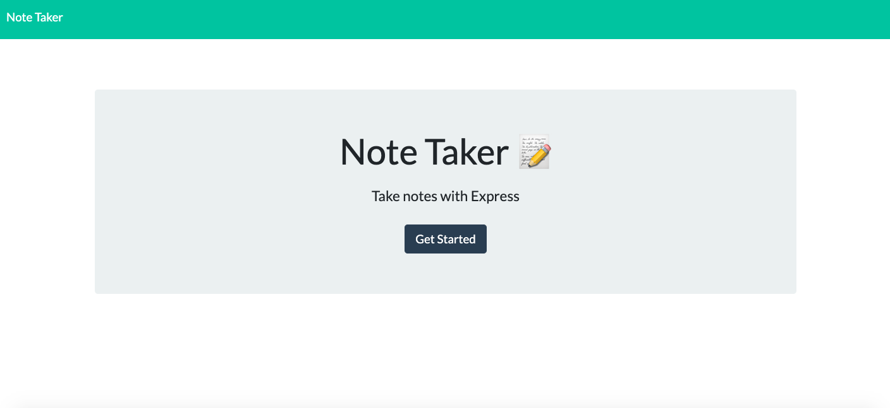

# note-taker

## Description
For users that need to keep track of a lot of information, it's easy to forget or be unable to recall something important. Being able to take persistent notes allows users to have written information available when needed.

This application can be used to write, save and delete notes. Using express backend, users are able to save and retrieve note data to better organize thoughts and keep track of tasks that need to be completed. 

## Installation

* Download Heroku or check if you have it installed by typing Heroku --version

* If you don't have it, here is the link to download: [Heroku](https://devcenter.heroku.com/articles/heroku-cli)

* The application is deployed on this platform.

## Links

[Application](https://notetaker024.herokuapp.com/)

[Github](https://github.com/katnguyenn/note-taker)

